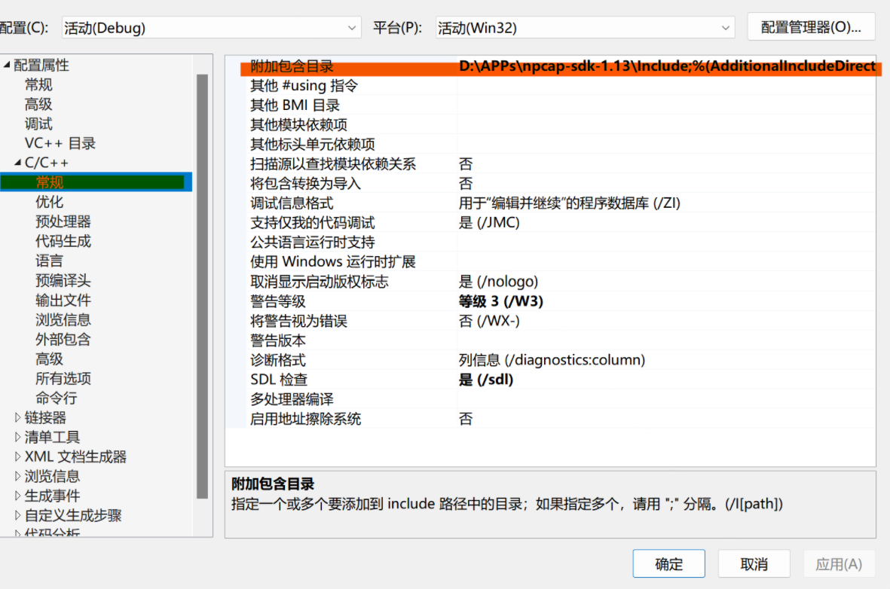
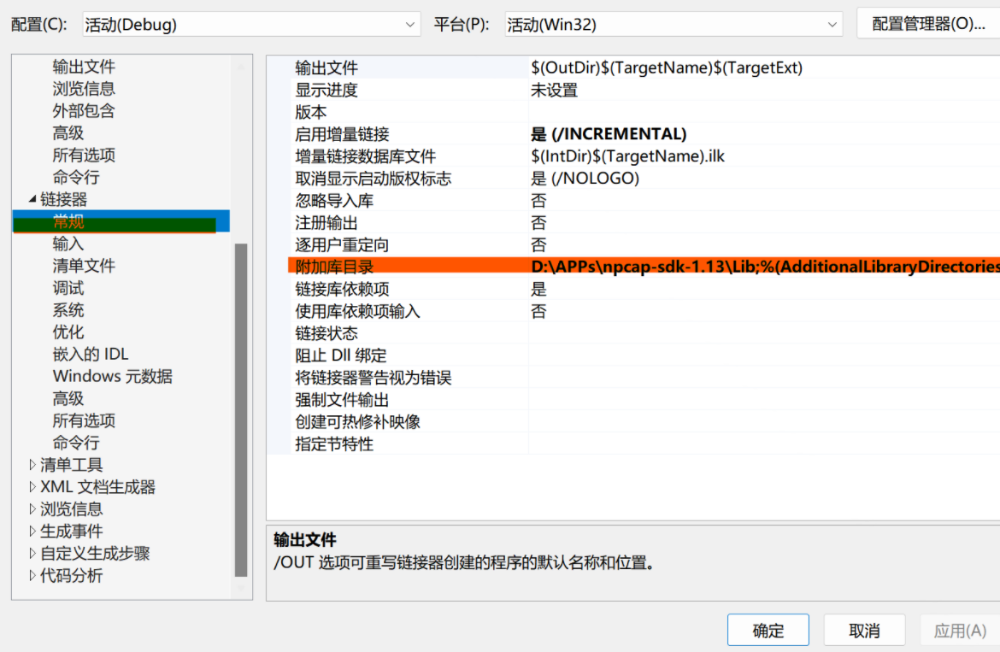
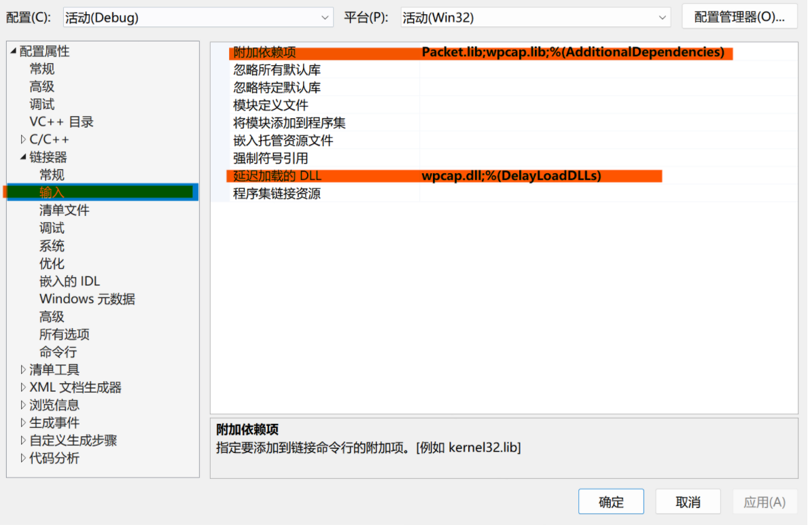

# 网络技术与应用课程报告

## 实验三：通过编程获取IP地址与MAC地址的对应关系

**姓名：孙悦**

**学号：2110052**

**专业：物联网工程**

## 一、实验内容

通过编程获取IP地址与MAC地址的对应关系实验，要求如下：

（1）在IP数据报捕获与分析编程实验的基础上，学习NPcap的数据包发送方法。

（2）通过NPcap编程，获取IP地址与MAC地址的映射关系。

（3）程序要具有输入IP地址，显示输入IP地址与获取的MAC地址对应关系界面。界面可以是命令行界面，也可以是图形界面，但应以简单明了的方式在屏幕上显示。

（4）编写的程序应结构清晰，具有较好的可读性。

## 二、实验准备

#### 1.ARP 协议

ARP 协议是“Address Resolution Protocol”（地址解析协议）的缩写。其作用是在以太网环境中，数据的传输所依赖的是 MAC 地址而非 IP 地址，而将已知 IP 地址转换为 MAC 地址的工作是由 ARP 协议来完成的。

在局域网中，网络中实际传输的是“帧”，帧里面是有目标主机的 MAC 地址的。在以太网中，一个主机和另一个主机进行直接通信，必须要知道目标主机的 MAC 地址。而目标MAC 地址是通过地址解析协议获得的。所谓“地址解析”就是主机在发送帧前将目标 IP 地址转换成目标 MAC 地址的过程。ARP 协议的基本功能就是通过目标设备的 IP 地址，查询目标设备的 MAC 地址，以保证通信的顺利进行。

#### 2.VS2019配置环境

在项目属性页中进行如下操作：

- C/C++-常规-附加包含目录添加npcap-sdk目录下的**Include**文件夹



- 链接器-常规-附加库目录 添加npcap-sdk目录下的**Lib**文件夹



- 链接器-输入-附加依赖项 输入添加**Packet.lib**和**wpcap.lib**
  
  链接器-输入-延迟加载的DLL 输入添加**wpcap.dll**



## 三、实验过程

#### 1.实验思路

本次实验需要获取主机网卡中对应 IP 的 MAC 地址，可以利用 ARP 请求方法，过程如下：

1. 获取网络接口卡列表，选择需要捕获 MAC 地址的网卡 A（或选择对应的 IP）；

2. 伪造 ARP 请求报文 ，内容要求如下：
   
   (1) ARP 请求
   
   (2) 广播
   
   (3) 伪造源 MAC 地址和源 IP 地址
   
   (4) 目的 IP 地址为网卡 A 的 IP 地址

3. 用网卡 A 发送报文 

4. 对网卡 A 进行流量监听，筛选其中的 ARP 报文（类型为 0x806），捕获网卡 A 的ARP 响应报文，在响应报文的帧首部源 MAC 地址部分可以看到发送该 ARP 响应的网卡对应的 MAC 地址

#### 2.代码分析

###### (1)定义报文和ip地址格式

```cpp
//报文格式定义
struct ethernet_header {
    uint8_t mac_dst[6];//目的MAC地址
    uint8_t mac_src[6];//源MAC地址
    uint16_t frame_type;//帧类型
};

typedef struct FrameHeader_t {//帧首部
    BYTE DesMAC[6];//目的地址
    BYTE SrcMAC[6];//源地址
    WORD FrameType;//帧类型
}FrameHeader_t;

typedef struct ARPFrame_t {//IP首部
    FrameHeader_t FrameHeader;
    WORD HardwareType;//硬件类型
    WORD ProtocolType;//协议类型
    BYTE HLen;//硬件地址长度
    BYTE PLen;//协议地址长度
    WORD Operation;//操作类型
    BYTE SendHa[6];//发送方MAC地址
    DWORD SendIP;//发送方IP地址
    BYTE RecvHa[6];//接收方MAC地址
    DWORD RecvIP;//接收方IP地址
}ARPFrame_t;

/*ip地址格式*/
typedef uint32_t in_addr_t;
```

###### (2)报文内容

```cpp
 //将APRFrame.FrameHeader.DesMAC设置为广播地址
    for (int i = 0; i < 6; i++)
        ARPFrame.FrameHeader.DesMAC[i] = 0xff;//表示广播
    //将APRFrame.FrameHeader.SrcMAC设置为本机网卡的MAC地址
    for (int i = 0; i < 6; i++)
        ARPFrame.FrameHeader.SrcMAC[i] = 0x0f;

    ARPFrame.FrameHeader.FrameType = htons(0x806);//帧类型为ARP
    ARPFrame.HardwareType = htons(0x0001);//硬件类型为以太网
    ARPFrame.ProtocolType = htons(0x0800);//协议类型为IP
    ARPFrame.HLen = 6;//硬件地址长度为6
    ARPFrame.PLen = 4;//协议地址长为4
    ARPFrame.Operation = htons(0x0001);//操作为ARP请求
    SerIP = ARPFrame.SendIP = htonl(0x00000000);//设置为任意IP地址
    //本机网卡的MAC地址
    for (int i = 0; i < 6; i++)
        ARPFrame.SendHa[i] = 0x0f;
    //本机网卡上绑定的IP地址
    ARPFrame.SendIP = htonl(0x00000000);
    //设置为0
    for (int i = 0; i < 6; i++)
        ARPFrame.RecvHa[i] = 0;//表示目的地址未知
```

###### (3)获取设备列表

用 pcap_findalldevs()函数获取网络接口设备列表，将设备列表存储为 alldevs 中，遍历打印列表信息。

```cpp
 if (pcap_findalldevs_ex(PCAP_SRC_IF_STRING, NULL, &alldevs, errbuf) == -1)//获得网卡列表
    {
        printf("获得网卡列表错误\n");
        exit(1);
    }
```

###### (4)打印网卡信息和对应IP

由用户输入设备信息，void findAllDevice(string& str,string IP[])将该网卡设备的名称、IP 地址储返回，设备名称 str 用于后面 pcap_open()函数打开该网卡，而 IP 将用

于构造 ARP 请求分组

```cpp
//利用pcap_findalldevs_ex函数获取本机网络接口卡以及网卡绑定的IP地址
    if (pcap_findalldevs_ex(PCAP_SRC_IF_STRING, NULL, &alldevs, errbuf) == -1)//获得网卡列表
    {
        printf("获得网卡列表错误\n");
        exit(1);
    }

    for (d = alldevs; d; d = d->next)
    {
        cout << "--------------------" << ++i << "--------------------" << endl;
        printf("%d. %s", i, d->name);
        if (d->description) {
            printf(" (%s)\n", d->description);

        }
        else
            printf(" (No description available)\n");
        a = d->addresses;
    A:    if (a != NULL) //相对第一次试验，增加输出IP地址，掩码，广播地址的代码
    {
        if (a->addr->sa_family == AF_INET)
        {
            cout << "  IP地址：\t\t" << inet_ntoa(((struct sockaddr_in*)(a->addr))->sin_addr) << endl;
            cout << "  网络掩码：\t\t" << inet_ntoa(((struct sockaddr_in*)(a->netmask))->sin_addr) << endl;
            cout << "  广播地址：\t\t" << inet_ntoa(((struct sockaddr_in*)(a->broadaddr))->sin_addr) << endl;
        }
        a = a->next;
        goto A;
    }
    }
```


###### (5)打开网络接口

```cpp
 // 找到要选择的网卡结构
    for (d = alldevs, i = 0; i < netcard_id - 1; d = d->next, i++);

    if ((adhandle = pcap_open(d->name, 65536, PCAP_OPENFLAG_PROMISCUOUS, 1000, NULL, errbuf)) == NULL)
    {
        pcap_freealldevs(alldevs);
        exit(1);
    }

    printf("\n接入对应端口 %s...\n", d->description);
```

###### (6)发送消息

用 adhandle 网卡发送 ARPFrame 中的内容，报文长度为 sizeof(ARPFrame_t)，如果发送成功，返回 0；

`pcap_sendpacket(adhandle, (u_char*)&ARPFrame, sizeof(ARPFrame_t))`

###### (7)捕获流量

```cpp
 if (pcap_sendpacket(adhandle, (u_char*)&ARPFrame, sizeof(ARPFrame_t)) != 0)
    {
        pcap_freealldevs(alldevs);
        throw - 7;
    }
    else
    {
        inum = 0;
    B:    int jdg_catch_re_arp_p = pcap_next_ex(adhandle, &adhandleheader, &adhandledata);
        IPPacket = (ARPFrame_t*)adhandledata;
        if (SerIP == IPPacket->SendIP)
            if (ReIP == IPPacket->RecvIP)
            {
                goto B;
            }
        //根据网卡号寻找IP地址，并输出IP地址与MAC地址映射关系
        if (SerIP == IPPacket->RecvIP)
            if (ReIP == IPPacket->SendIP)
            {
                cout << "IP地址与MAC地址的对应关系如下：" << endl << "IP："; ip_protocal_addr(IPPacket->SendIP);
                cout << "MAC："; mac_addr(IPPacket->SendHa);
                cout << endl;
            }
            else
                goto B;
        else
            goto B;
    }
```

###### (8)获得网卡的MAC地址

采用的方法为：封装 ARP 请求时使用本机网卡的 IP 和 MAC 地址

1. 判断是否为本机 IP 地址或远程 IP 地址

2. 利用上述方法请求本地网卡的 MAC 地址，将本机 IP 和 MAC 填入报文

3. 重新发送 ARP 请求

```cpp
//根据网卡号寻找IP地址，并输出IP地址与MAC地址映射关系
        if (SerIP == IPPacket->RecvIP)
            if (ReIP == IPPacket->SendIP)
            {
                cout << "IP地址与MAC地址的对应关系如下：" << endl << "IP："; ip_protocal_addr(IPPacket->SendIP);
                cout << "MAC："; mac_addr(IPPacket->SendHa);
                cout << endl;
            }
//如果不是本机就寻找远程ip对应的Mac地址重新发送ARP请求
if (ifIP=='N') {//如果是远程主机
        SerIP = ARPFrame.SendIP = IPPacket->SendIP;
        for (i = 0; i < 6; i++)
        {
            ARPFrame.SendHa[i] = ARPFrame.FrameHeader.SrcMAC[i] = IPPacket->SendHa[i];
        }
    }  
```

#### 3.实验结果

由于 ARP 协议广播分组是对相同网段内的主机进行的，不能跨网段直接获取远程主机的 MAC 地址，因此为实现获取远程主机 Ip 地址与 Mac 的对应关系，采用两个主机连接同一地点校园网或热点进行实验验证；

其中本机 ip 地址为 10.130.126.47；

远程主机 ip 地址为 10.130.105.119；

- 获取网卡列表：


- 查询本机 IP 地址与 MAC 地址的对应关系：


- 查询远程 IP 地址与 MAC 地址的对应关系：


- 查询本机ip和Mac地址对应关系与通过 ipconfig/all 命令获取的 ip 地址与 MAC 地址的对应关系一致：


实验完成！
